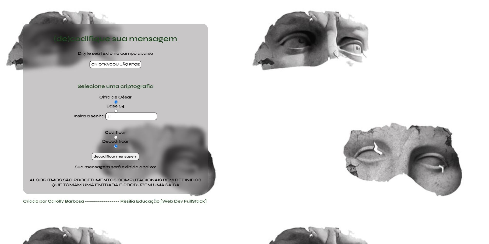

# Encriptador/Decriptador  

### Proposta
###### Aplicação capaz de codificar e decodificar mensagens utilizando cifra de césar e base64, utilizando conhecimentos de HTML, CSS e JavaScript - com foco em manipulação de DOM - aplicados durante o segundo módulo do curso de formação em Desenvolvimento Web Full Stack Resilia.

### Contexto
###### Sua aplicação deve ser capaz de codificar e decodificar mensagens utilizando tanto base64 quanto cifra de césar. Para isso, ela deve conter um formulário com:
- [x] Um campo de entrada textual, da mensagem que será codificada ou decodificada;
- [x] Um campo de seleção, com as opções "cifra de césar" e "base64" com o seguinte comportamento: com "cifra de césar" ativo na seleção, um novo campo deve surgir no formulário para que seja possível fornecer o incremento utilizado na cifra
- [x] Dois campos radiais (radio buttons) com os textos: "codificar" e "decodificar"
- [x] Um botão que, com "codificar" selecionado exibe o texto "Codificar Mensagem!" e com "decodificar" selecionado exibe "Decodificar Mensagem!"
- [x] Um outro campo textual deve ser utilizado na página para que o resultado da codificação e decodificação possa ser exibido para a pessoa usuária.
- [x] Sua página deve estar contida em um repositório no Github e uma página do Github pages deve ser disponibilizada com sua aplicação.

### Atualização JAN/2022:

- [x] Projeto no padrão MVC (Model-View-Controller);
- [x] Utilização de JQuery;
- [x] Debug das funções de Cifra de César.

### Melhorias a serem feitas:

- [x] Utilização de classe super para View, classes filhas herdando os métodos e atributos (EncryptorView e DecryptorView são bastante semelhantes e podem herdar atributos/métodos de uma superclass);
- [x] Implementação de header e footer, semântica do HTML;
- [x] Campos de texto maiores para que a mensagem não apareça cortada, melhor experiência de usuário;
- [x] Esvaziar campos de entrada do usuário após as consultas.

### Demonstração
